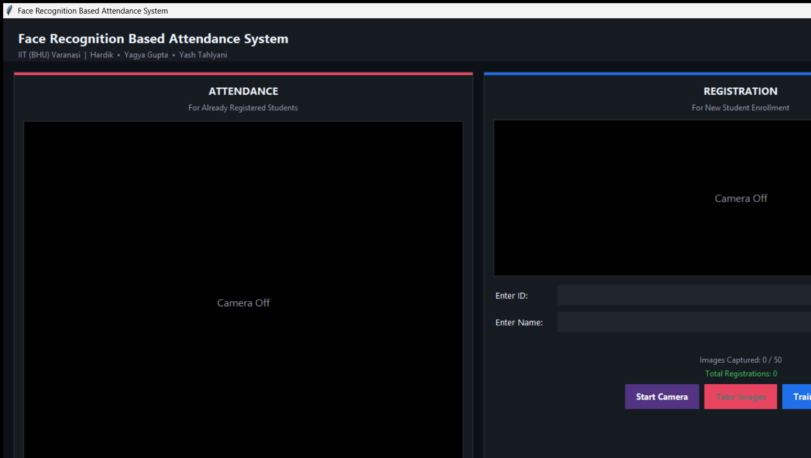

<div align="center">

# Face Recognition Based Attendance System

**Automated, contactless attendance marking using real-time face recognition**

[](https://python.org)
[](https://opencv.org)
[](LICENSE)
[](https://www.microsoft.com/windows)
[-Varanasi-B22222?style=for-the-badge)](https://iitbhu.ac.in)

<br/>

*Exploratory Project · Department of Computer Science & Engineering*
*Indian Institute of Technology (BHU) Varanasi*

</div>

---

## Overview

Traditional attendance systems are slow, error-prone, and require physical contact or manual effort. This project replaces that entirely with a **camera-based face recognition pipeline** that detects a student's face in real time, matches it against a trained model, and instantly marks attendance in a dated CSV file — all through a clean desktop interface.

The system was built over three months as part of the Exploratory Project curriculum at IIT (BHU) Varanasi, going from dataset collection and feasibility study in Month 1, through prototype development in Month 2, to a polished, deployment-ready application by Month 3.

---

## Screenshot



> Left panel handles live attendance scanning. Right panel handles student registration — enter ID, name, capture 50 face images, then train the model. Live clock and team credits always visible in the header.

---

## Features

- **Real-time face detection** using OpenCV Haar Cascade classifier
- **LBPH face recognition** — lightweight, works offline, no cloud dependency
- **One-click registration** — captures 50 face images automatically with diversity throttling
- **Instant attendance marking** — no button press needed once camera is running
- **Duplicate-safe** — a student can only be marked once per day regardless of how long they stay in frame
- **Dated CSV records** — one file per day, viewable inside the app with color-coded present/absent rows
- **Camera conflict prevention** — opening one panel's camera auto-stops the other
- **Dark, professional UI** — built with Tkinter, no external UI framework needed

---

## Tech Stack

| Component | Library / Tool | Version |
|---|---|---|
| Face Detection | OpenCV Haar Cascade | 4.13 |
| Face Recognition | OpenCV LBPH Recognizer | 4.13 |
| GUI | Tkinter (built-in) + Pillow | Python 3.11 |
| Attendance Records | pandas + CSV | 2.x |
| Image Processing | NumPy + Pillow | 2.x |
| Camera Backend | DirectShow (Windows) | — |

---

## Project Structure

```
Exploratory/
│
├── main.py                  # Entry point — launches the Tkinter app
├── app.py                   # Full GUI: both Attendance and Registration panels
├── face_trainer.py          # LBPH model training from captured face images
├── attendance_manager.py    # Daily CSV attendance logic (mark, load, list)
│
├── requirements.txt         # pip dependencies
├── LICENSE                  # MIT License
├── README.md
│
├── dataset/                 # Face images captured during registration (git-ignored)
│   └── User.<id>.<n>.jpg
├── trainer/                 # Trained LBPH model file (git-ignored)
│   └── trainer.yml
└── Attendance/              # Daily attendance CSVs (git-ignored)
    └── Attendance_DD-MM-YYYY.csv
```

---

## Setup & Installation

### Prerequisites

- Python 3.11 or higher
- A working webcam
- Windows OS (uses DirectShow camera backend)

### 1 — Clone the repository

```bash
git clone https://github.com/yashtahlyani/Exploratory.git
cd Exploratory
```

### 2 — Install dependencies

```bash
pip install -r requirements.txt
```

### 3 — Run the application

```bash
python main.py
```

---

## How to Use

### Step 1 — Register a Student

1. Open the **REGISTRATION** panel (right side of the window)
2. Enter the student's **numeric ID** and **Full Name**
3. Click **Start Camera** — the webcam activates with a live preview
4. Click **Take Images** — the system automatically captures 50 face images (spaced out for diversity)
5. Click **Train & Save** — trains the LBPH model on all registered students

> Repeat steps 2–5 for each additional student. The model is retrained each time to include everyone.

### Step 2 — Mark Attendance

1. Open the **ATTENDANCE** panel (left side)
2. Click **Take Attendance** — the camera begins scanning
3. When a registered face is detected with sufficient confidence, attendance is marked automatically
4. The student's name, timestamp, and confidence score appear on screen
5. Click **Stop** when the session is over

### Step 3 — View Records

1. Click **View Records** on the Attendance panel
2. Select a date from the dropdown
3. Browse the color-coded table — **green** = Present, **red** = Unknown/Absent

---

## How It Works

```
Camera Frame
     │
     ▼
Haar Cascade Detector  ──►  No face?  ──►  Skip frame
     │
     ▼ (face ROI detected, ≥50×50 px)
Resize to 100×100 px
     │
     ▼
LBPH Recognizer.predict()
     │
     ├── confidence < 80  ──►  Recognized  ──►  Mark attendance in CSV
     │
     └── confidence ≥ 80  ──►  Unknown     ──►  Show warning on screen
```

The LBPH (Local Binary Pattern Histogram) algorithm encodes texture patterns around each pixel into a histogram. It is fast, runs entirely on CPU, and works well with small datasets (50 images per person).

---

## Monthly Progress

| Month | Focus | Deliverable |
|---|---|---|
| **1** | Feasibility study, reference visit to IIT Ropar (similar system), dataset planning | Student dataset (10 friends, ID card images, Excel sheet) |
| **2** | Initial prototype, LBPH integration, dataset expansion, accuracy testing | Working recognition model with 50 images/student |
| **3** | GUI polish, lighting robustness, bug fixes, deployment readiness | Final application — stable, user-friendly, ready for demo |

---

## Configuration

Key constants at the top of `app.py` can be tuned without touching any logic:

```python
CONFIDENCE_THRESHOLD = 80   # lower = stricter match (LBPH: lower confidence = better)
MIN_FACE_PX          = 50   # ignore faces smaller than 50×50 pixels
CAPTURE_EVERY_N      = 4    # save 1 image every 4 frames (~7–8 fps at 30fps camera)
```

And in `face_trainer.py`:

```python
FACE_SIZE = (100, 100)      # all faces resized to this before training and prediction
```

---

## Team

| Name | Roll Number |
|---|---|
| Hardik Dochania | 24045055 |
| Yagya Gupta | 24045146 |
| Yash Tahlyani | 24045147 |

**Supervisors:** Prof. Pradeep Kumar · Prof. Durga Prasad
**Teaching Assistant:** Mr. Kushagra Singh

---

## License

This project is licensed under the **MIT License** — see [LICENSE](LICENSE) for details.

---

<div align="center">

Made with dedication at **IIT (BHU) Varanasi**

</div>
